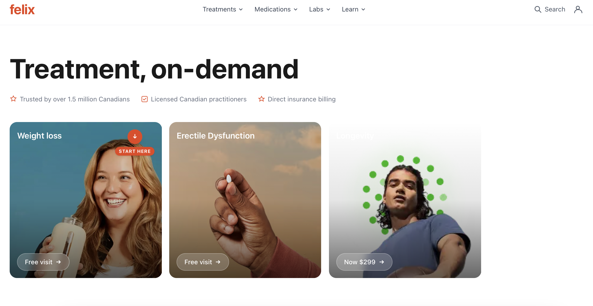
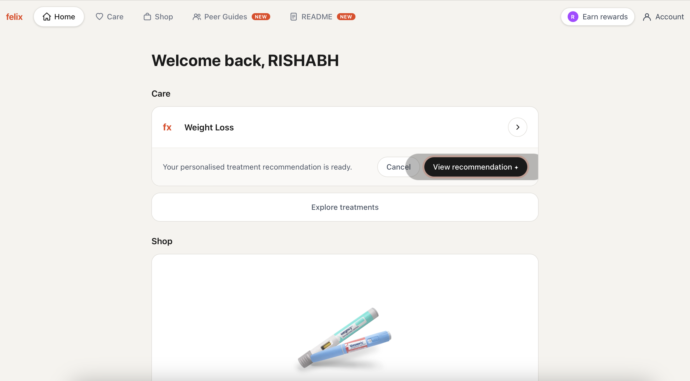
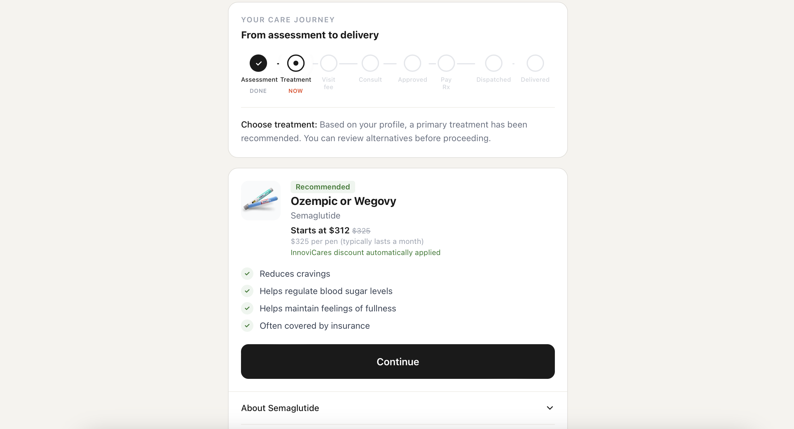

# Felix — Patient onboarding to personalized care, end-to-end

> **Live demo:** https://rishabh-felix-demo.vercel.app



## About Felix

**Industry:** Telehealth / Digital health (Canada)

**What they do:** Felix is a Canadian online medical platform that connects patients to licensed practitioners for ongoing treatment of conditions like weight management, sexual health, and longevity. Patients complete an intake, get matched with a clinician, and receive prescriptions delivered to their door.

## The case study

**Problem.** Telehealth onboarding tends to be either too clinical (a wall of medical questions) or too marketing-led (a sales page in a doctor's lab coat). Patients drop off before the care relationship even starts.

**Approach.** The demo turns intake into a guided journey: a treatment-led landing page, a conditional questionnaire that adapts to the patient's answers, a "matching" loading state that frames the wait as a clinical review, and a dashboard that resolves to a personalized treatment plan with peer guides, labs, medications, and learning resources.

**Outcome.** A working end-to-end patient journey — from landing page through questionnaire to the post-intake dashboard — that shows how thoughtful onboarding can live inside a telehealth product without losing the care signal.

## What I built

- Treatment-led landing page with three care tracks (Weight Loss, ED, Longevity)
- Adaptive intake questionnaire with conditional branching
- Matching loading state with clinical framing (not a generic spinner)
- Patient dashboard with treatment plan, medications, labs, peer guides, and learning resources
- Peer-guides feature: persona cards that anchor the post-intake experience in real patient-like journeys

## Tech stack

- Next.js 16 (App Router) + React 19
- TypeScript, Tailwind CSS
- Deployed on Vercel

## Run locally

```bash
git clone https://github.com/rishabhqueens/felix-telehealth-demo.git
cd felix-telehealth-demo
npm install
npm run dev
```

## Screenshots





---

Part of the [PM Reimagines](https://github.com/rishabhqueens/pm-reimagines) portfolio — a set of product-management case studies built as working demos.

> *This is an unaffiliated personal demo built to explore product ideas in Felix's space. It is not endorsed by, affiliated with, or representative of Felix Health Inc. All brand names and trademarks belong to their respective owners.*
